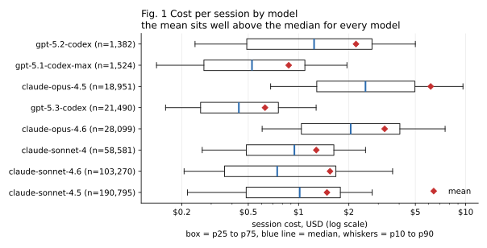
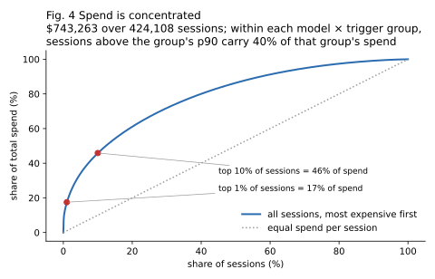
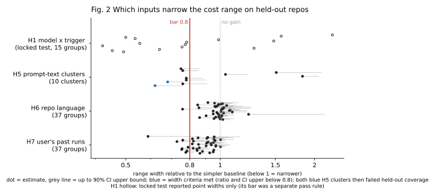
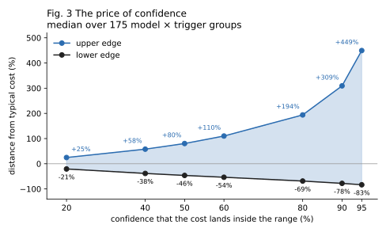
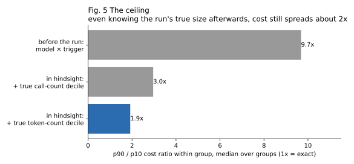

# What an AI coding-agent run will cost: what can be known before it starts, and what can only be seen while it runs

**Status:** DRAFT v0.2, 2026-10-07. Written by the assistant from the lab record; Karl Sundström to review, rewrite and approve before anything is public. Changes from v0.1 are listed at the end.
**Author:** Karl Sundström (Agent Recourse).

**TL;DR:** None of the inputs we tested could say reliably, before a coding-agent run started, what it would cost; most of the spread arises during the run. Two things did work: a calibrated lower bound, and, during the run, a size threshold past which runs mostly fail.

---

## Abstract

We asked whether the cost of an AI coding-agent run can be predicted before the run starts, and if not, what can usefully be said instead. On 424,108 sessions from the public AgentLogs dataset (list-price-equivalent spend $743,263), with every pass bar committed before the data it was tested on and with repositories held out, the tested predictors mostly failed. Grouping by model, trigger and prompt length narrowed the 80% cost range in 5 of 15 groups on a locked test (26.7% of test sessions, 18.1% of spend); 4 groups came out wider than the model alone. Prompt text, repository language and size, and the user's own past runs did not narrow it further (0 of 10, 0 of 37 and 0 of 37 groups passed). An empirical 90% lower bound was calibrated on the locked test (90.0% of runs met it; per-group bounds were consistent with 90% in 10 of 15 groups) and in a secondary analysis of one external benchmark dataset (90.1%); the registered two-dataset replication could not be evaluated. During a run, the signal is strong but associational: across 171,000 runs from three public software-engineering benchmarks, runs above their group's 90th percentile of estimated size resolved their task 2.3 to 7 times less often than runs in the bottom half. Stopping runs at that threshold lowered estimated tokens per resolved task in two of three datasets (by 9% and 20%) and raised it in the third (by 3%).

## 1. Introduction

<!-- Agent harnesses show cost after the fact, if at all. Users of routing services such as OpenRouter often see $0, because the harness never receives the provider's price ([Hermes PR #128755](https://github.com/NousResearch/hermes-agent/pull/128755) proposes a fix; we tested it and reported results there). The question behind this work is simpler and harder: when someone types a task into an agent, can we tell them what it will cost? -->

A weather forecast is a useful comparison. It is accurate for tomorrow and useless for next month, because small differences compound. An agent run is a sequence of model calls, each depending on the last: whether the first attempt works, whether a test fails, whether the agent gets stuck. If each step is uncertain, a forecast made before step one should be wide. This study measures how wide, and what, if anything, narrows it.

**Terms.**
- *Session* or *run*: one agent invocation from trigger to finish.
- *Trigger*: what started it (a PR comment, an issue assignment, a review request, an API call).
- *Priced session*: a session with at least 4 model calls, all on models with a known list price.
- *Cost*: list-price-equivalent spend, defined in §3; not a billed amount.
- *Group*: model x trigger x prompt-length bucket (under 200, 200 to 1,499, 1,500+ characters).
- *Range*: p10 to p90 of training costs in a group (nominal 80% interval). *Width*: p90/p10.
- *Lower bound* (called "floor" in v0.1): a p10 of training costs, a one-sided bound that a new run is expected to meet or exceed 90% of the time. It is a prediction bound, not a guarantee.
- *Estimated size*: for benchmark data without cost, the sum over assistant turns of the cumulative characters read up to that turn, divided by 4.
- *Tail*: runs above their group's p90. *Bottom half*: at or below the group median.

## 2. Hypotheses

What started out as a single hypothesis (H1) quickly grew to multiple new theories that underwent testing.

Bars were committed to `agentlogs/PLAN.md` before the data they were tested on (commit in brackets). IDs: H = hypotheses on AgentLogs; R = replication on external data; O = outcome question on benchmark data.

| ID | Claim | Pass bar | Registered |
|---|---|---|---|
| H1 | Groups (model x trigger x prompt length) give narrower ranges than the model alone | width <= 0.8x model-only, 90% CI upper of that ratio < 0.8, coverage CI contains 80%; in >= 3 of 15 groups | `fc4ec02` |
| H2 | A loop detector flags runs over-represented in the most expensive tenth | ratio >= 2.0 (CI lower >= 1.5) AND >= 20% of top-decile spend after onset AND hand-check false-positive rate <= 30% | `fc4ec02` |
| H3 | Flagged runs fail more often | exploratory, no bar | `fc4ec02` |
| H4 | p10 is a calibrated lower bound | overall coverage CI contains 90% AND per-group CI contains 90% in >= 2/3 of groups | `88dfab6` |
| H5 | Prompt-text clusters narrow ranges | >= 2 clusters pass the H1 width bar | `78fa206`; final `cff0cea` |
| H6 | Repository language and size narrow ranges further | >= 1/3 of groups pass | `9638be8` |
| H7 | The user's own recent runs narrow ranges further | >= 1/3 of groups pass | `9638be8` |
| R4 | H1 and H4 replicate on other public datasets | pass in every evaluable dataset, >= 2 evaluable | `2b8c3f7` |
| O1 | Tail runs resolve their task less often | tail/bottom-half resolve ratio <= 0.8 and CI upper < 0.8, in >= 2 datasets | `272c139` |

Analyses added after a draft review are labelled **post-hoc** where they appear.

## 3. Method

**Data.** `risenlab/agentlogs` (CC BY 4.0, revision `04013a44d3432c6654bca1dcd4a01218a9406b80`): step logs of GitHub-triggered coding-agent sessions, mostly on Claude Sonnet models. All 276 log shards were parsed. Sessions with at least 4 priced calls were kept: 424,108 sessions in 30,143 repositories. The cut excludes 15,849 priced sessions with 3 or fewer calls (3.6% of priced sessions, 0.7% of priced spend) and 31,110 sessions on models without a list price. Repository metadata (1.8M repositories) joined to every kept session.

**Cost.** Tokens multiplied by a snapshot of OpenRouter list prices taken on 2026-10-06 (`lab.py`), with cached input priced separately. This is a list-price equivalent: it ignores negotiated discounts, provider routing, subscription plans and failed calls, and no public dataset was available to check it against billed amounts. Dollar figures describe the logged period at those prices, not current prices.

**Splits.** Development shards were explored freely; five validation shards were used once per decision; ten locked-test shards, drawn with `random.Random(20261006)`, were used exactly once (H1, H4). Later rounds split by repository (or by task instance for benchmarks), so every tested range is scored on repositories it was not fitted on. For H7, a user's history counts only sessions created strictly before the predicted one; the same user may appear in fit and test data by design, since a deployed tool would know the user's own past.

**Scoring.** A group passes the range test if its width is at most 0.8x the model-only width, the 90% bootstrap CI of that ratio stays below 0.8, and the share of held-out runs inside the range is consistent with 80%. Bootstrap resamples are drawn over training repositories, so clustering within repositories is preserved; the reported upper bound is the 95th percentile (one-sided 95%, equivalently the top of a two-sided 90% interval). Coverage mainly guards against ranges that are narrow because they are wrong; width carries the claim.

**Multiplicity.** With 15 groups and a null effect, about 0.75 groups would be expected to pass H1's three-part bar by chance; 5 passed. H6 and H7 passed 0 of 37 each, so no correction can change those verdicts.

**External data.** Replication used `Exgentic/agent-llm-traces-v2` (10,056 benchmark runs with reported agent cost; no licence listed) and `MaxDevv/real-pi-coding-agent-traces-sessions` (1,291 developer sessions; licence "other"). From these, only aggregate statistics are reported and no rows are redistributed. A third candidate, `open-agent-leaderboard/traces`, was dropped before any cost was read because 94% of its sessions duplicated Exgentic. The outcome question used `SWE-bench/SWE-smith-trajectories` (MIT), `nebius/SWE-rebench-openhands-trajectories` and `nebius/SWE-agent-trajectories` (both CC BY 4.0): 171,000 runs with a test-verified resolved label and no cost. The divisor in "characters / 4" does not affect any result: every threshold is a within-group percentile, and dividing all sizes by a constant leaves every rank unchanged.

## 4. Results

### 4.1 Cost is skewed and concentrated

Every model's mean sits well above its median (Fig. 1). The most expensive 1% of sessions carry 17% of all spend and the most expensive 10% carry 46% (Fig. 4). Within each group, sessions above the group's p90 still carry 40% of that group's spend.

### 4.2 Before the run: ranges

| Test (registered) | Result |
|---|---|
| H1, validation (7,687 sessions) | 6 of 15 groups pass: **PASS** |
| H1, locked test (15,349 sessions, 6,509 repositories) | 5 of 15 pass: **PASS**. The 5 cover 26.7% of test sessions and 18.1% of spend. Best group 5.4x vs 12.8x model-only. 4 groups were wider than model-only. |
| H5, prompt-text clusters (92,429 sessions, 13,535 repositories) | 0 of 10: **FAIL**. Two clusters met both width criteria but failed coverage on held-out repositories (73% to 78% against 80%). |
| H6, repository language and size (66,603 held-out sessions) | 0 of 37: **FAIL**. Median width ratio 0.99. |
| H7, the user's last 10 earlier runs | 0 of 37: **FAIL**. Median width ratio 0.88: directionally helpful (about 12% narrower), but no group cleared the bar with its confidence interval. |

Prompt text loses even to the coarse grouping: groups have a median width of 11.3x, prompt clusters 16.4x. Many prompts are short ("fix the CI", "did you do it?") and say little about the work they will cause.

Fig. 3 shows what confidence costs. A range that contains the true cost half the time runs from 46% below to 80% above the typical cost; at 90% confidence it runs from 78% below to 309% above.

### 4.3 Before the run: the lower bound

H4 passed on the locked test (registered). Its overall bound, the p10 of all development sessions ($0.23), was met by 90.0% of the 15,349 test sessions. Per-group bounds were consistent with 90% in 10 of 15 groups.

A post-hoc comparison shows what grouping adds. Pooled over the 15 groups, the group bounds, the model-only bounds and the single global bound were all met by about 89.5% of runs. Pooled coverage is not where grouping helps. It helps per group:

- Group bounds held for 83% to 94% of runs in every group.
- The model-only bound held for 54% to 99% of runs, depending on the group.
- The global bound held for 52% to 100%.

For Sonnet 4.5 review requests, the global bound of $0.23 held for only 52% of runs, while the group bound ($0.07) held for 91%. Group bounds are also informative values, from $0.07 to $1.02, at 21% to 45% of the group median. Per-group detail is in `revision_v02.out`; the full table of 175 groups is in `agentlogs/figures/groups_full.csv`.

### 4.4 Why prediction stays wide

Two measurements bound what the tested predictors could achieve.

- **Ceiling (held-out development data, `rescore_dev.out`).** Adding the run's *true* call count, known only afterwards, to a log-linear interval model narrowed the range to 4.3x for tokens and 5.3x for dollars. The best pre-run grouping reached 14.3x and 10.7x.
- **Fig. 5 (a different, in-sample view).** Within each group, splitting runs into deciles of their true call count or token count leaves a median 3.0x and 1.9x spread. It is not zero because deciles are coarse and runs differ in cached share, which prices differently. These in-sample figures are lower than the held-out ones and should be read as optimistic.
- **Noise floor (exploratory).** In `melissapan/swe-bench-lite-agent-traces-v14` (CC BY 4.0), 21 harness x model setups ran the same 30 tasks three times each. For the identical task on the identical setup, the most and least expensive of three runs differ by a median 1.55x (p90 2.86x). This was computed during the data survey, before any plan, and is not a registered test.

What this shows is narrower than impossibility. None of the inputs we tested gave reliable narrowing out of sample, and a meaningful spread remains even with information no pre-run predictor could have. A predictor using inputs we did not test, such as the repository's state or the agent's planned steps, might do better.

### 4.5 External validation: one evaluable dataset

The registered rule (R4) needed two independent evaluable datasets. Neither candidate met the registered minimum group size (100 fit / 30 test sessions). Under a secondary minimum of 50 / 20, added before any cost was read and labelled secondary throughout, only Exgentic qualified (60 groups); the developer-session set had one eligible group. **R4 is therefore not evaluable**, for both H1 and H4.

In the secondary Exgentic analysis, the lower bound held for 90.1% [89.1%, 91.4%] of held-out runs, and 48 of 60 groups were individually consistent with 90%. The range result (29 of 60 groups passing) mostly reflects model-only baselines that mix six benchmarks and are therefore very wide (up to 232x). Where a model's baseline was narrow (GPT-5.2, 6.2x), 1 of 11 groups passed and 4 were wider than baseline.

### 4.6 During the run: loops (H2, H3)

A detector flagged runs with long stretches of repeated identical tool calls or no file edits. On development data, flagged runs were 3.3x [3.0, 3.6] as common in the most expensive tenth as elsewhere (40% vs 12%), and 26% of top-tenth spend came after the flag. In a blind hand-check of 60 runs by one rater, 20 of 30 flagged runs were judged not to be stuck: a 67% false-positive rate against the registered 30% maximum. **H2 fails.** The rater's answers also drifted with case order, so the reference itself is weak.

H3 (exploratory): flagged runs ended as failed, cancelled or timed out 5.6% of the time (n = 1,206), against 5.1% for the rest (n = 7,010): essentially no difference. The flag marks expensive runs, not stuck or failing ones, and it was dropped as a loop detector.

### 4.7 During the run: size and failure (O1)

| Dataset | Runs | Resolve rate, tail | Resolve rate, bottom half | Ratio [90% CI] |
|---|---|---|---|---|
| SWE-smith | 23,821 | 20.7% | 51.8% | **0.40** [0.37, 0.43] |
| SWE-rebench OpenHands | 67,074 | 22.6% | 52.9% | **0.43** [0.38, 0.47] |
| SWE-agent | 80,036 | 3.5% | 25.4% | **0.14** [0.12, 0.16] |

O1 passes in all three (registered). Counting turns instead of estimated size gives the same ratios. The resolve rate falls almost steadily with size decile (SWE-smith: 62% in the smallest tenth, 21% in the largest). Overall resolve rates are 44%, 48% and 16.7%. SWE-agent's lower base rate makes its ratio more extreme, but its ordering matches the other two.

This is an association. Harder tasks are both larger and more often failed, so O1 does not show that a run grows large *because* it is going wrong, or that stopping it would lose nothing.

**Runtime alarm (post-hoc).** To test the alarm as a deployed tool would run it, thresholds were set on 70% of task instances (group p90 of final estimated size) and applied, turn by turn, to the other 30%. "Similar runs" means the same model (SWE-smith, SWE-agent) or the same repository (SWE-rebench), the only grouping these datasets allow.

| | SWE-smith | SWE-rebench OH | SWE-agent |
|---|---|---|---|
| Held-out runs | 7,240 | 5,508 | 24,682 |
| Alarm fires on | 9.9% | 10.8% | 10.9% |
| ... of resolved runs (false alarms if stopping) | 4.5% | 5.3% | 2.4% |
| Resolve rate, fired vs not fired | 19.5% vs 44.8% | 19.9% vs 43.6% | 3.3% vs 16.7% |
| Share of estimated tokens still ahead when it fires (median) | 27% | 11% | 29% |
| Estimated tokens per resolved run, stopping at the alarm | **-9.2%** | **+2.6%** | **-20.3%** |

Whether stopping is worth it depends on the setup. In SWE-rebench the alarm fires late (11% of the run left), and stopping costs more resolved runs than it saves in tokens. A warning, which leaves the decision to a person, has no such cost; whether people act on it well is untested.

## 5. Discussion

**What the evidence supports.** A substantial part of agent-run cost was not predictable from any input we tested, and that part shows up during the run. Coarse lower bounds stay calibrated per group, and a run's size relative to similar runs is a strong in-run signal of trouble.

**What can be built honestly from this:**
1. *Before sending:* a calibrated lower bound and a typical value per model and trigger ("at least $0.54, usually $1.29"), with the range shown as the wide thing it is.
2. *During the run:* a warning when the run crosses what 90% of similar runs reached. On benchmarks, failing runs collect there. Stopping automatically is a trade whose sign depends on the setup.
3. *For long conversations:* separate the work an agent does from the context it carries, and show both (Box A).

**Limits.**
- AgentLogs is one population: GitHub-triggered agents, mostly Claude Sonnet.
- Cost is list-price-equivalent, not billed.
- The failure results use estimated size on benchmark tasks, and they are associational.
- The external replication was not evaluable under its registered rule.
- The ceiling in Fig. 5 is in-sample.
- The loop hand-check had one rater whose judgements drifted.

**Disclosures.** All are logged with dates in `PLAN.md`.
- The first H5 canary script checked the width estimate but omitted its confidence interval, and appeared to pass 4 of 7 clusters. This was corrected before reporting (0 of 7).
- R4 eligibility and the developer-set split were amended before cost was read, from group sizes only.
- R4 computed its results, crashed in a summary print, and was re-run with fixed seeds; the numbers were identical.
- One benchmark file set held 2,255 duplicate rows. Removing them changed the SWE-smith ratio from 0.38 to 0.40; the corrected figures are used throughout.
- Draft v0.1 overstated the replication and misreported several details; see the change log.

> **Box A. Illustrative case study, n = 1 (not evidence for the general claims).** The author's own agent logs (token counts only, about 2,000 calls) show a pattern absent from all the public datasets above, which contain task runs only. In one conversation of 601 calls, 93% of 76.6M tokens were the model re-reading earlier context, and context per call grew from 17k to 217k tokens (Fig. 6). A simple counterfactual treats each turn as starting a fresh session whose context is the session's opening context plus only what that turn added itself. It assumes no retrieval cost and no loss of useful memory. Under that model, the same turns would have read about 4.7x less input. Some of the carried context is memory the user wants; current tools do not show what retaining it is worth.
>
> 

## 6. Data and code

Repository: (URL to add on publication; commit to cite). Python 3.14, pyarrow 25.0.1, numpy 2.5.3, matplotlib 3.11.2, huggingface_hub 2.1.1. Inputs are public and pinned by revision; the repository contains no dataset rows. See `README.md` for run order.

## Change log from v0.1 (response to an LLM-generated review, 2026-10-07)

- Abstract no longer claims a successful independent replication; §4.5 states that R4 is not evaluable.
- H2 and H3 reported (§4.6).
- "Cost" defined as list-price-equivalent, with the price snapshot date; benchmark size called "estimated size" throughout.
- H1 described with its registered grouping; "about a third of situations" replaced by session and spend shares.
- Ceiling numbers paired with their conditions; in-sample vs held-out stated; nonzero spread explained.
- "Floor" renamed to a 90% lower bound; the overall H4 figure reported as 90.0% (v0.1 printed a degenerate-looking "[90%, 90%]"); post-hoc comparison with model-only and global bounds added.
- "The information does not exist" replaced with the narrower claim in §4.4.
- Runtime alarm analysis added (post-hoc).
- n = 1 case study moved to a labelled box; counterfactual assumptions stated.
- Notes on H7's 0.88, multiplicity, H7 history construction, the excluded low end, the divisor, SWE-agent's base rate, bootstrap sidedness and licences.
- Abstract ratio range corrected from "2.5 to 7" to "2.3 to 7".
- Not changed:
  - The reviewer's claim that SWE-agent's overall resolve rate is 3.5%. It is 16.7%; 3.5% is the tail.
  - The request for a chars/4 sensitivity analysis. The results are rank-invariant, so one sentence in §3 covers it.
  - Validation against billed cost. No public data exists for it, so the claim was narrowed instead.

## Open items before publication (for Karl)

- [ ] Rewrite in your own voice; this is a reconstruction.
- [ ] Decide whether Box A stays.
- [ ] Approve making the repository public; add URL and commit hash to §6.
- [ ] Port into agentrecourse.org `/journal`.
